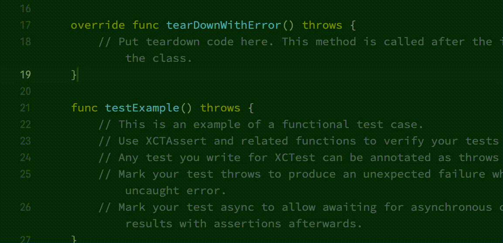
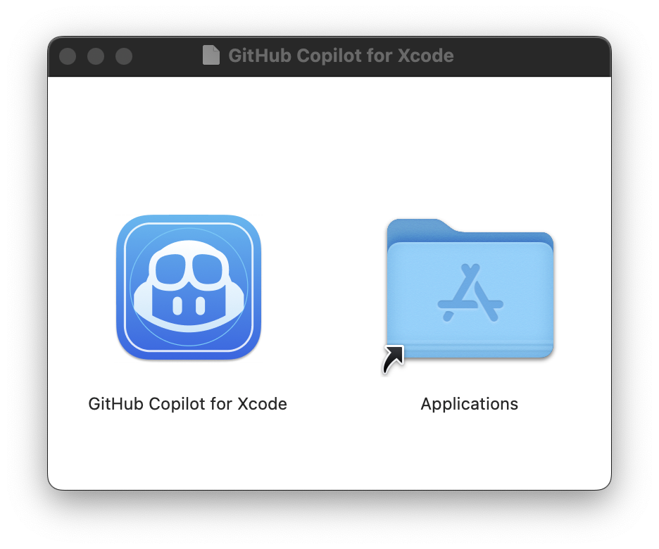
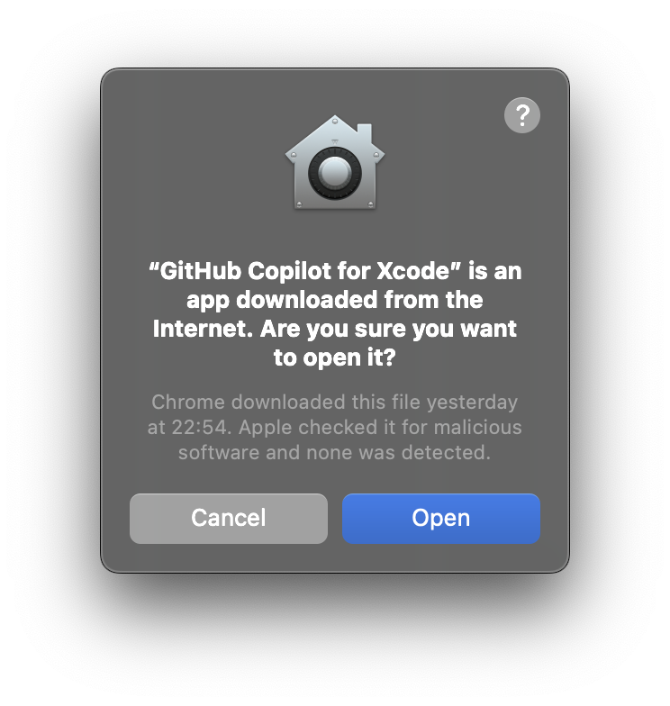
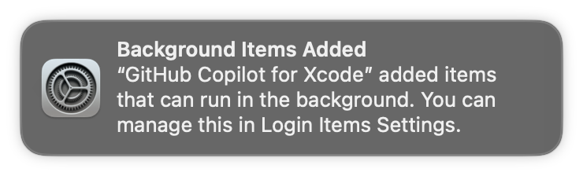
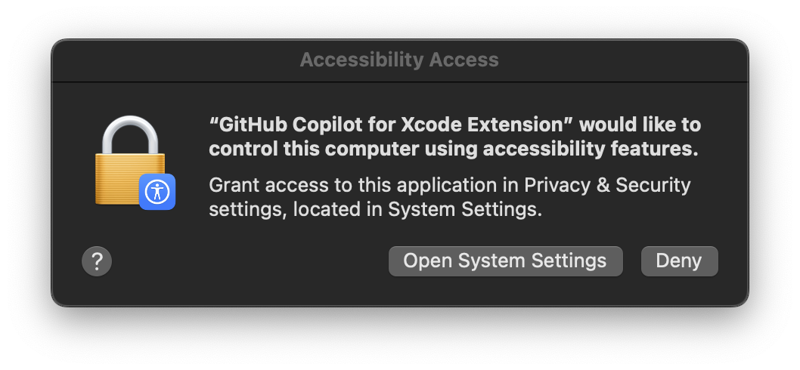
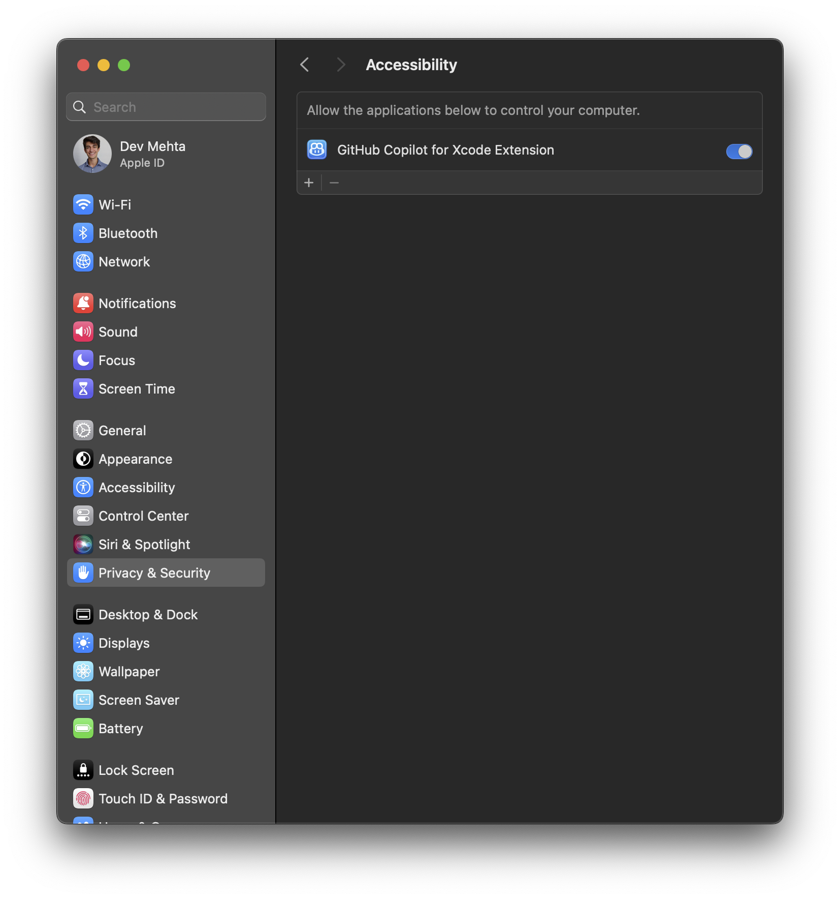
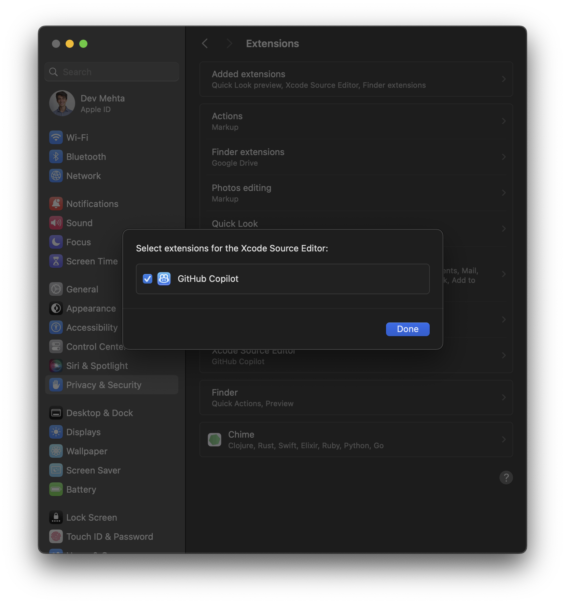
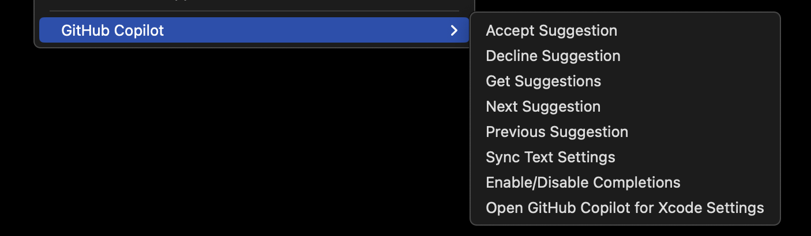
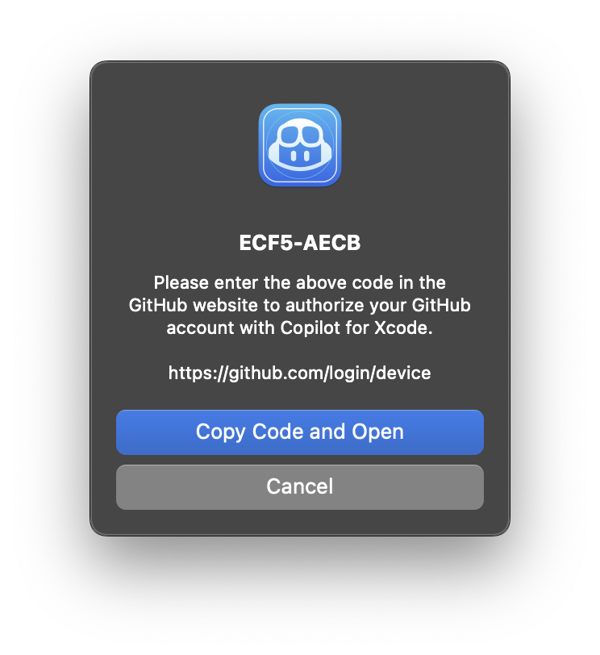

<<<<<<< main
#  GitHub Copilot for Xcode

[GitHub Copilot](https://github.com/features/copilot) for Xcode is the leading AI coding assistant for Swift, Objective-C and iOS/macOS development. It delivers intelligent Completions, Chat, and Code Review—plus advanced features like Agent Mode, Next Edit Suggestions, MCP Registry, and Copilot Vision to make Xcode development faster and smarter.

## Chat

GitHub Copilot Chat provides suggestions to your specific coding tasks via chat.


## Agent Mode

GitHub Copilot Agent Mode provides AI-powered assistance that can understand and modify your codebase directly. With Agent Mode, you can:
- Get intelligent code edits applied directly to your files
- Run terminal commands and view their output without leaving the interface
- Search through your codebase to find relevant files and code snippets
- Create new files and directories as needed for your project
- Get assistance with enhanced context awareness across multiple files and folders
- Run Model Context Protocol (MCP) tools you configured to extend the capabilities

Agent Mode integrates with Xcode's environment, creating a seamless development experience where Copilot can help implement features, fix bugs, and refactor code with comprehensive understanding of your project.

## Code Completion

You can receive auto-complete type suggestions from GitHub Copilot either by starting to write the code you want to use, or by writing a natural language comment describing what you want the code to do.

=======
#  GitHub Copilot For Xcode



GitHub Copilot for Xcode is macOS application and Xcode extension that enables
using GitHub Copilot code completions in Xcode.

## Beta Preview Policy

As per [GitHub's Terms of Service](https://docs.github.com/en/github/site-policy/github-terms-of-service#j-beta-previews) we want to remind you that:

> Beta Previews may not be supported or may change at any time. You may receive confidential information through those programs that must remain confidential while the program is private. We'd love your feedback to make our Beta Previews better.

>>>>>>> 4a8ae39

## Requirements

- macOS 12+
- Xcode 8+
<<<<<<< main
- A GitHub account

## Getting Started

1. Install via [Homebrew](https://brew.sh/):

   ```sh
   brew install --cask github-copilot-for-xcode
   ```

   Or download the `dmg` from
   [the latest release](https://github.com/github/CopilotForXcode/releases/latest/download/GitHubCopilotForXcode.dmg).
   Drag `GitHub Copilot for Xcode` into the `Applications` folder:

   <p align="center">
     
   </p>

   Updates can be downloaded and installed by the app.

1. Open the `GitHub Copilot for Xcode` application (from the `Applications` folder). Accept the security warning.
   <p align="center">
     
   </p>


1. A background item will be added to enable the GitHub Copilot for Xcode extension app to connect to the host app. This permission is usually automatically added when first launching the app.
   <p align="center">
     
   </p>

1. Three permissions are required for GitHub Copilot for Xcode to function properly: `Background`, `Accessibility`, and `Xcode Source Editor Extension`. For more details on why these permissions are required see [TROUBLESHOOTING.md](./TROUBLESHOOTING.md).

   The first time the application is run the `Accessibility` permission should be requested:

   <p align="center">
     
   </p>

   The `Xcode Source Editor Extension` permission needs to be enabled manually. Click
   `Extension Permission` from the `GitHub Copilot for Xcode` application settings to open the
   System Preferences to the `Extensions` panel. Select `Xcode Source Editor`
   and enable `GitHub Copilot`:

   <p align="center">
     
   </p>

1. After granting the extension permission, open Xcode. Verify that the
   `Github Copilot` menu is available and enabled under the Xcode `Editor`
   menu.
    <br>
    <p align="center">
      
    </p>

    Keyboard shortcuts can be set for all menu items in the `Key Bindings`
    section of Xcode preferences.

1. To sign into GitHub Copilot, click the `Sign in` button in the settings application. This will open a browser window and copy a code to the clipboard. Paste the code into the GitHub login page and authorize the application.
    <p align="center">
      
    </p>

1. To install updates, click `Check for Updates` from the menu item or in the
   settings application.

   After installing a new version, Xcode must be restarted to use the new
   version correctly.

   New versions can also be installed from `dmg` files downloaded from the
   releases page. When installing a new version via `dmg`, the application must
   be run manually the first time to accept the downloaded from the internet
   warning.

1. To avoid confusion, we recommend disabling `Predictive code completion` under
   `Xcode` > `Preferences` > `Text Editing` > `Editing`.

1. Press `tab` to accept the first line of a suggestion, hold `option` to view
   the full suggestion, and press `option` + `tab` to accept the full suggestion.

## How to use Chat

   Open Copilot Chat in GitHub Copilot.
  - Open via the Xcode menu `Xcode -> Editor -> GitHub Copilot -> Open Chat`.
  <p align="center">
    
  </p>

  - Open via GitHub Copilot app menu `Open Chat`.

  <p align="center">
    
  </p>

## How to use Code Completion

   Press `tab` to accept the first line of a suggestion, hold `option` to view
   the full suggestion, and press `option` + `tab` to accept the full suggestion.
=======
- A GitHub Copilot subscription. To learn more, visit [https://github.com/features/copilot](https://github.com/features/copilot).

## Getting Started

1. Download the latest `dmg` from: https://github.com/github/copilot-xcode/releases/latest/download/GitHubCopilotForXcode.dmg
   Updates can be downloaded and installed by the app.

1. Open the `dmg` and drag the `GitHub Copilot for Xcode.app` into the `Applications` folder.
   <br>
   

1. On the first opening the application it will warn that it was downloaded from the internet. Click `Open` to proceed.
   <br>
   

1. A background item will be added for the application to be able to start itself when Xcode starts.
   <br>
   

1. Two important permissions are required for the application to operate well: `Accessibility` and `Xcode Source Editor Extension`. The first time the application is run these permissions should be requested. You may need to click `Refresh` in the settings if not prompted.
   <br>
   
   
   

1. After granting the extension permission, please restart Xcode so the `Github Copilot` menu is available under the Xcode `Editor` menu.
    <br>
    <br>
    

1. To sign into GitHub Copilot, click the `Sign in` button in the settings application. This will open a browser window and copy a code to the clipboard. Paste the code into the GitHub login page and authorize the application.
   <br>
   

1. To install updates, click `Check for Updates` from the menu item or in the settings application. After installing a new version, Xcode must be restarted to use the new version correctly. New versions can also be installed from `dmg` files downloaded from the releases page. When installing a new version via `dmg`, the application must be run manually the first time to accept the downloaded from the internet warning.
   <br>
   <image alt="Screenshot of update message" src="./Docs/update-message.png" width="372" />
>>>>>>> 4a8ae39

## License

This project is licensed under the terms of the MIT open source license. Please
<<<<<<< main
refer to [LICENSE.txt](./LICENSE.txt) for the full terms.

## Privacy

We follow responsible practices in accordance with our
[Privacy Statement](https://docs.github.com/en/site-policy/privacy-policies/github-privacy-statement).

To get the latest security fixes, please use the latest version of the GitHub
Copilot for Xcode.
=======
refer to [MIT](./LICENSE.txt) for the full terms.
>>>>>>> 4a8ae39

## Support

We’d love to get your help in making GitHub Copilot better!  If you have
feedback or encounter any problems, please reach out on our [Feedback
<<<<<<< main
forum](https://github.com/github/CopilotForXcode/discussions).

## Acknowledgements

Thank you to @intitni for creating the original project that this is based on.

Attributions can be found under About when running the app or in
[Credits.rtf](./Copilot%20for%20Xcode/Credits.rtf).
=======
forum](https://github.com/orgs/community/discussions/categories/copilot).

## Acknowledgement

Thank you to @intitni for creating the original that this project is based on.
>>>>>>> 4a8ae39
